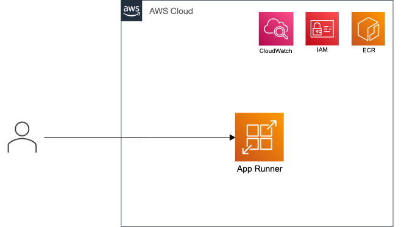

# 一番シンプルなパターン



## デプロイ

```
# ECR
$ aws cloudformation deploy --template-file ecr.template.yaml --stack-name fastrunner-ecr

# イメージ PUSH
$ aws ecr get-login-password --region ap-northeast-1 | docker login --username AWS --password-stdin{AWS アカウントID}.dkr.ecr.ap-northeast-1.amazonaws.com

$ docker build -t fastrunner-image .

$ docker tag fastrunner-image:latest {AWSアカウントID}.dkr.ecr.ap-northeast-1.amazonaws.com/fastrunner-image:latest

$ docker push {AWSアカウントID}.dkr.ecr.ap-northeast-1.amazonaws.com/fastrunner-image:latest

# App Runner
aws cloudformation deploy --template-file app_runner.template.yaml --stack-name fastrunner-app-runner --capabilities CAPABILITY_NAMED_IAM
```
