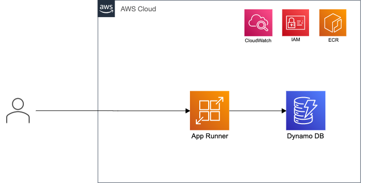

# DynamoDB から取得するパターン



## 開発方法

### 1.　 docker-compose 起動

```sh
docker-compose up -d --build
```

### 2. ローカルにアクセス

```
curl http://localhost:8000/items/1
```

### DynamoDB のデータをカスタマイズする場合

[init.sh](./scripts/init.sh) から変更する

## デプロイ

```
# DynamoDB
$ aws cloudformation deploy --template-file dynamodb.template.yaml --stack-name fastrunner-dynamodb

# ECR
$ aws cloudformation deploy --template-file ecr.template.yaml --stack-name fastrunner-ecr

# イメージ PUSH
./deploy.sh

# App Runner
aws cloudformation deploy --template-file app_runner.template.yaml --stack-name fastrunner-app-runner --capabilities CAPABILITY_NAMED_IAM
```
