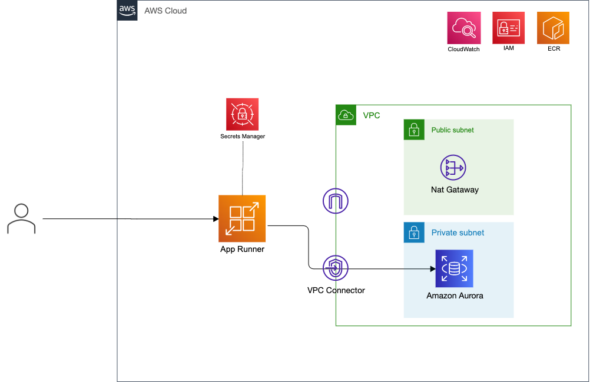

# Aurora から取得するパターン



## 開発方法

### 1.　 docker-compose 起動

```sh
docker compose up -d --build
```

### 2. ローカルにアクセス

```
curl http://localhost:8000/items/1
```

### MySQL のデータをカスタマイズする場合

[initDb.sql](./scripts/initDb.sql) から変更する

本当はスキーマからマイグレーションで初期セットアップした方が良さそう（？）

## デプロイ

```
# VPC
$ aws cloudformation deploy --template-file vpc.template.yaml --stack-name fastrunner-vpc

# Security Group
$ aws cloudformation deploy --template-file security_group.template.yaml --stack-name fastrunner-sg

# Aurora Subnet Group
$ aws cloudformation deploy --template-file db_subnet_group.template.yaml --stack-name fastrunner-subnet-group

# Aurora
$ aws cloudformation deploy --template-file aurora.template.yaml --stack-name fastrunner-aurora

# ECR
$ aws cloudformation deploy --template-file ecr.template.yaml --stack-name fastrunner-ecr

# イメージ PUSH
./deploy.sh

# App Runner
aws cloudformation deploy \
    --template-file app_runner.template.yaml　\
    --stack-name fastrunner-app-runner \
    --capabilities CAPABILITY_NAMED_IAM \
    --parameter-overrides DbName=MyDBName
```
